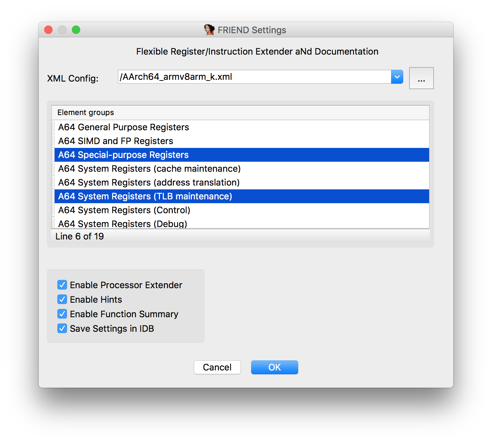

# FRIEND

**F**lexible **R**egister/**I**nstruction **E**xtender a**N**d **D**ocumentation

## Features

FRIEND is an IDA plugin created to improve disassembly and bring register/instruction documentation right into IDA View.

### 1. Improved processor modules using third party libraries (like Capstone)   


### 2. Hints for instructions and registers in IDA View and Decompiler View   


### 3. Ability to show external reference for highlighted item in a browser    


### 4. Function Summary in IDA View and Decompiler View   


### 5. Ability to pick only features you are interested in and save setting in IDB



Note: it may be confusing if there's only one element group, you still need to
click on it to enable the features.

## How to build

### Preparing the build environment

To build the IDA plugin, there are few dependencies to satisfy:

* [CMake](https://cmake.org/download/) 3.3 or higher
* GCC or Clang on Linux/macOS. On Windows, use the
  Visual Studio 2015.
* Git
* IDA SDK (unpack into ``idasdk``)
* Hex-Rays SDK (optional, copy to ``hexrays_sdk``)

Unzip the contents of the IDA SDK into `idasdk`, and copy the Hex-Rays SDK to hexrays_sdk (use `-DUSE_HEXRAYS=OFF` with cmake to build without HexRays support). On Linux or MacOS, one can use the following commands:

```sh
$ unzip /path/to/idasdkXX.zip -d idasdk
$ mv idasdk/idasdkXX/* idasdk
$ rm -r idasdk/idasdkXX
$ cp -r /path/to/ida/plugins/hexrays_sdk hexrays_sdk
```

### CMake options

`USE_HEXRAYS=OFF` - to build without HexRays decompiler SDK (`ON` by default)  
`USE_IDA6_SDK=ON` - to build against IDA 6.x SDK (`OFF` by default)

### Linux

Use ``cmake`` to prepare the build environment and run ``make`` to build the plugins:

```sh
$ mkdir _build
$ cd _build
$ cmake [-DUSE_HEXRAYS=OFF] [-DUSE_IDA6_SDK=ON] ..
$ make
```

### MacOS

Use ``cmake`` to prepare the build environment and run ``make`` to build the plugins:

```sh
$ mkdir _build
$ cd _build
$ cmake [-DUSE_HEXRAYS=OFF] [-DUSE_IDA6_SDK=ON] ..
$ make
```

If you prefer to have an Xcode project and build everything from there, run the following commands instead:

```sh
$ mkdir _build
$ cd _build
$ cmake -G Xcode [-DUSE_HEXRAYS=OFF] [-DUSE_IDA6_SDK=ON] ..
$ open FRIEND.xcodeproj # or simply run xcodebuild
```

### Windows

Use ``cmake`` to prepare the build environment and run ``make`` to build the plugins:

```sh
$ mkdir _build
$ cd _build
$ "%VS140COMNTOOLS%\..\..\VC\vcvarsall.bat" x86
$ cmake -G "Visual Studio 14 2015" [-DUSE_HEXRAYS=OFF] [-DUSE_IDA6_SDK=ON] ..
$ msbuild FRIEND.sln /p:Configuration=Release
```

x64 build instructions (tested for IDA Pro 7.0 on Windows 10 x64):
```sh
mkdir _build64
cd _build64
"%VS140COMNTOOLS%\..\..\VC\vcvarsall.bat" x64
cmake -G "Visual Studio 14 2015 Win64" [-DUSE_HEXRAYS=OFF] [-DUSE_IDA6_SDK=ON] ..
msbuild FRIEND.sln /p:Configuration=Release /p:Platform=X64 /m
```

## Installation

Copy the built binaries into the IDA Pro plugins directory. These are the default paths:

OS      | Plugin path
--------|-------------------------------------------
Linux   | `/opt/ida-X.X/plugins`
macOS   | `/Applications/IDA Pro X.X/idabin/plugins`
Windows | `%ProgramFiles(x86)%\IDA 6.X\plugins` or `%ProgramFiles%\IDA 7.X\plugins`

## Configuration files

The content of hints is discussed [here](https://github.com/alexhude/FRIEND/issues/1)

FRIEND configuration file has following structure:

```
<?xml version="1.0" encoding="utf-8" standalone="no"?>
<documentation>
	<document id="pdf_id" name="ARM Architecture Reference Manual" version="A.k">
		<path>/path/to/your/pdf/or/link</path>
	</document>
	<elements>
		<group type="reg" name="Group Name">
			<hint page="1" header="Element Header" doc_id="pdf_id" token="R0">info</>
			...
		</group>
		<group type="ins" name="Group Name">
			<hint page="2" header="Element Header" doc_id="pdf_id" token="MOV">info</>
			...
		</group>
		...
	</elements>
</documentation>
```

Please note that you have to put your own \<path\> to pdf file to be able to use external documentation in a browser.

You can use a local file too.  Assuming your pdf is in `/Users/foo/doc/doc.pdf`, just
put that after `<path>`.  Do not add `file://` as it will be prepended later.

## Hint Editor

To make contribution to this project easier, there is a simple config editor.  


__NOTE:__ It can only be built on MacOS with Xcode 8 or higher. Other systems are not supported.

Use ``cmake`` to generate Xcode project.

```sh
$ cd HintEditor/HintEditor/
$ mkdir _build
$ cd _build
$ cmake -G Xcode ..
$ xcodebuild
```

Launch the application bundle with ``open``:

```
$ open Debug/HintEditor.app
```

## Dependencies

FRIEND requires:  
- [IDA SDK](https://www.hex-rays.com/products/ida/support/download.shtml)   
- [Capstone](https://github.com/aquynh/capstone) (built with Patches/capstone.diff)  
- [pugixml](https://github.com/zeux/pugixml)

Hint Editor requires:  
- [AEXML](https://github.com/tadija/AEXML) (built with Patches/aexml.diff)  

## Credits

@ **in7egral, mbazaliy** for bug reports and all kind of support    
@ __qwertyoruiopz, iH8sn0w, Morpheus\_\_\_\_\_\_, xerub, msolnik, marcograss, pr0x13, \_argp, oleavr, brinlyau__ and other gang for inspiration  
@ __\_kamino\___ for porting project to Windows and Linux  
@ __williballenthin__ for the idea of function summary
